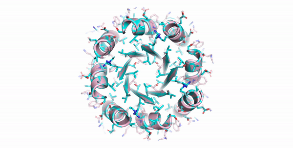

# Protein sequence design with a learned potential

Code for the algorithm in our paper 

> Namrata Anand-Achim, Raphael R. Eguchi, Alexander Derry, Russ B. Altman, and Possu Huang. "Protein sequence design with a learned potential." bioRxiv (2020).
> [[biorxiv]](https://www.biorxiv.org/content/10.1101/2020.01.06.895466v1) [[cite]](#citation)



Entirely AI designed four-fold symmetric TIM-barrel

## Requirements

* Python 3
* [PyTorch](https://pytorch.org)
* [PyRosetta4](http://www.pyrosetta.org/dow)
* Python packages in requirements.txt
* Download pretrained models [here](https://drive.google.com/file/d/1X66RLbaA2-qTlJLlG9TI53cao8gaKnEt/view?usp=sharing) 

See [here](https://github.com/nanand2/protein_seq_des/blob/master/SETUP.md) for set-up instructions on Ubuntu 18.04 with Miniconda, Python 3.7, PyTorch 1.1.0, CUDA 9.0. 


## Design

If you'd like to use the pre-trained models to run design, jump to [[this section]](#running-design)

## Generating data
Data is available [here](https://console.cloud.google.com/storage/browser/seq-des-data) on GCP. Note you will need to authenticate to access the data and link a billing account as well to pay for the download.

If you'd like to generate the dataset or change the underlying data run the following commands.

To load and save coordinates for the backbone (BB) only model:
```
python load_and_save_bb_coords.py --save_dir PATH_TO_SAVE_DATA --pdb_dir PATH_TO_PDB_FILES --log_dir PATH_TO_LOG_DIR --txt PATH_TO_DOMAIN_TXT_FILE
```

To load and save coordinates for the main model:
```
python load_and_save_coords.py --save_dir PATH_TO_SAVE_DATA --pdb_dir PATH_TO_PDB_FILES --log_dir PATH_TO_LOG_DIR --txt PATH_TO_DOMAIN_TXT_FILE
```

Inputs to the data generation script are .txt files with the domain IDs (see data/train_domains_s95.txt and data/test_domain_s95.txt). If you don't have PDB files downloaded, the script will download those and save it to pdb_dir.


## Training the models

Pretrained models are available [here](https://drive.google.com/file/d/1cHoyeI0H_Jo9bqgFH4z0dfx2s9as9Jp1/view?usp=sharing) but you can also use the available scripts to train from scratch.

To train the baseline model -- residue and autoregressive rotamer prediction conditioned on backbone (BB) atoms only model (no side-chains):
```
python train_autoreg_chi_baseline.py --batchSize 4096 --workers 12 --lr 1.5e-4 --validation_frequency 100 --save_frequency 1000 --log_dir PATH_TO_LOG_DIR --data_dir PATH_TO_DATA
```

To train the main model -- residue and autoregressive rotamer prediction conditioned on neighboring side-chains:
```
python train_autoreg_chi.py --batchSize 2048 --workers 12 --lr 7.5e-5 --validation_frequency 200 --save_frequency 2000 --log_dir PATH_TO_LOG_DIR --data_dir PATH_TO_DATA
```
Note that training was originally done across 8 V100 GPUs with DataParallel mode.


  
## Running design

To run a design trajectory, specify starting backbone with an input PDB. 

```
python run.py --pdb pdbs/3mx7_gt.pdb
```

To run a rotamer repacking trajectory with the model, specify the repack only option
```
python run.py --pdb pdbs/3mx7_gt.pdb --repack_only 1
```

To specify k-fold symmetry in design or packing, specify the symmetry options 
```
python run.py --pdb pdbs/tim10.pdb --symmetry 1 --k 4 [--repack_only 1]
```

To constraint a subset of positions to remain fixed, point to a txt file with fixed residue indices, for example
```
python run.py --pdb pdbs/tim10.pdb --fixed_idx txt/test_idx.txt
```

And to constrain a subset of positions to be designed, keeping all others fixed, point to a txt file with variable residue indices, for example
```
python run.py --pdb pdbs/tim10.pdb --var_idx txt/test_idx.txt
```

See [below](#design-parameters) for additional design parameters.
  
## Monitoring metrics
Design metrics can be monitored using Tensorboard

```
tensorboard --log_dir='./logs'
```

Note that the input PDB sequence and rotamers are considered 'ground-truth' for sequence and rotamer recovery metrics.


## Design parameters

* Design inputs
```
  --pdb              Path to input PDB
  --model_list       Paths to conditional models. (Default: ['models/conditional_model_0.pt', 
                     'models/conditional_model_0.pt', 'models/conditional_model_1.pt', 
                     'models/conditional_model_2.pt', 'models/conditional_model_3.pt'])
  --init_model       Path to baseline model for sequence initialization.
                     (Default: 'models/baseline_model.pt')
```
* Saving / logging
```
  --log_dir             Path to desired output log folder for designed
                        structures.  (Default: ./logs)
  --seed                Random seed. Design runs are non-deterministic.
                        (Default: 2)
  --save_rate           How often to save intermediate designed structures
                        (Default: 10)

```
* Sequence initialization
```
  --randomize {0,1}     Randomize starting sequence/rotamers for design.
                        Toggle to 0 to keep starting sequence and rotamers.
                        (Default: 1)
  --no_init_model {0,1} Do not use baseline model to predict initial sequence/rotamers.
                        (Default: 0)
  --ala {0,1}           Initialize sequence with poly-alanine. (Default: 0)
  --val {0,1}           Initialize sequence with poly-valine. (Default: 0)
```
* Rotamer repacking parameters
```
  --repack_only {0,1}   Only run rotamer repacking.  (Default: 0)
  --use_rosetta_packer {0,1}
                        Use the Rosetta packer instead of the model for
                        rotamer repacking during design.  If in symmetry 
                        mode, rotamers are not packed symmetrically. (Default: 0)
  --pack_radius         Radius in angstroms for Rosetta rotamer packing after
                        residue mutation. Must set --use_rosetta_packer 1
                        (Default: 0)
```
* Design parameters
```
  --symmetry {0,1}      Enforce symmetry during design (Default: 0)
  --k                   Enforce k-fold symmetry. Input pose length must be
                        divisible by k. Requires --symmetry 1 (Default: 4)
  --restrict_gly {0,1}  Enforce no glycines for non-loop backbone positions
                        based on DSSP assignment. (Default: 1)
  --no_cys {0,1}        Enforce no cysteines in design (Default: 0)
  --no_met {0,1}        Enforce no methionines in design (Default: 0)
  --var_idx             Path to txt file listing pose indices that should be
                        designed/packed, all other side-chains will remain
                        fixed. Cannot be specified if fixed_idx file given. 
                        Not supported with symmetry mode. 0-indexed
  --fixed_idx           Path to txt file listing pose indices that should NOT
                        be designed/packed, all other side-chains will be
                        designed/packed. Cannot be specified if var_idx file given. 
                        Not supported with symmetry mode. 0-indexed 
  --resfile		        Enforce resfile on particular residues. 0-indexed
```

learn more about [resfile](https://github.com/ProteinDesignLab/protein_seq_des/tree/master/seq_des/util)

* Sampling / optimization parameters
```
  --anneal {0,1}        Option to do simulated annealing of average negative
                        model pseudo-log-likelihood. Toggle to 0 to do vanilla
                        blocked sampling (Default: 1)
  --step_rate           Multiplicative step rate for simulated annealing (Default: 0.995)
  --anneal_start_temp   Starting temperature for simulated annealing (Default: 1)
  --anneal_final_temp   Final temperature for simulated annealing (Default: 0)
  --n_iters             Total number of iterations (Default: 2500)
  --threshold           Threshold in angstroms for defining conditionally
                        independent residues for blocked sampling (should be
                        greater than ~17.3) (Default: 20)
```

Additional information
* Code expects single chain PDB input.
* Specifying fixed/variable indices not currently supported in symmetry mode.
* Model rotamer packing in symmetry mode does symmetric rotamer packing, but using the Rosetta packer does not.

## Citation
If you find our work relevant to your research, please cite:
```
@article{anand2020protein,
  title={Protein sequence design with a learned potential},
  author={Anand, Namrata and Eguchi, Raphael Ryuichi and Derry, Alexander and Altman, Russ B and Huang, Possu},
  journal={bioRxiv},
  year={2020},
  publisher={Cold Spring Harbor Laboratory}
}
```
