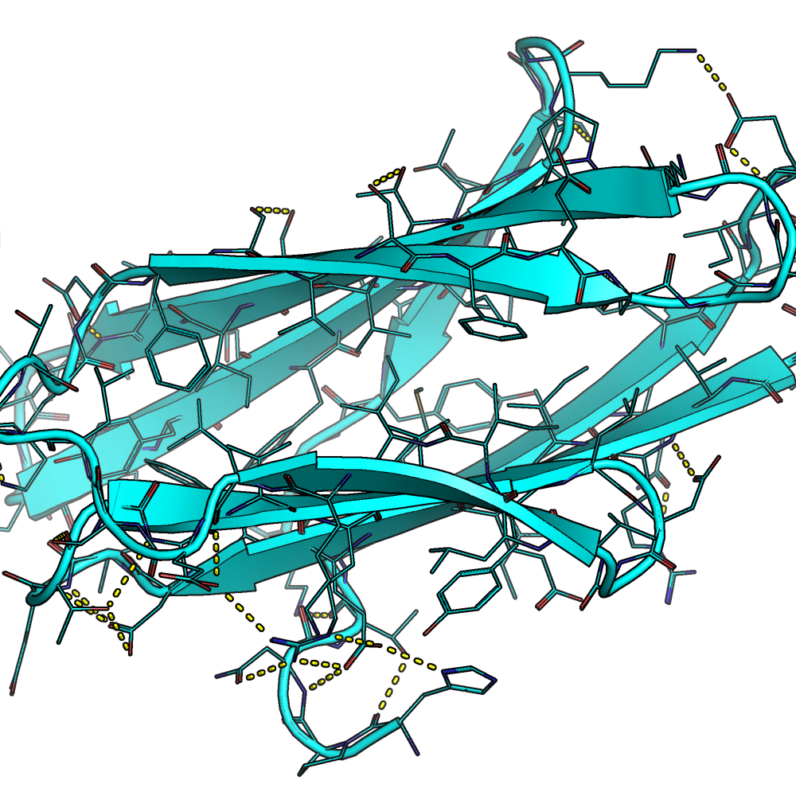
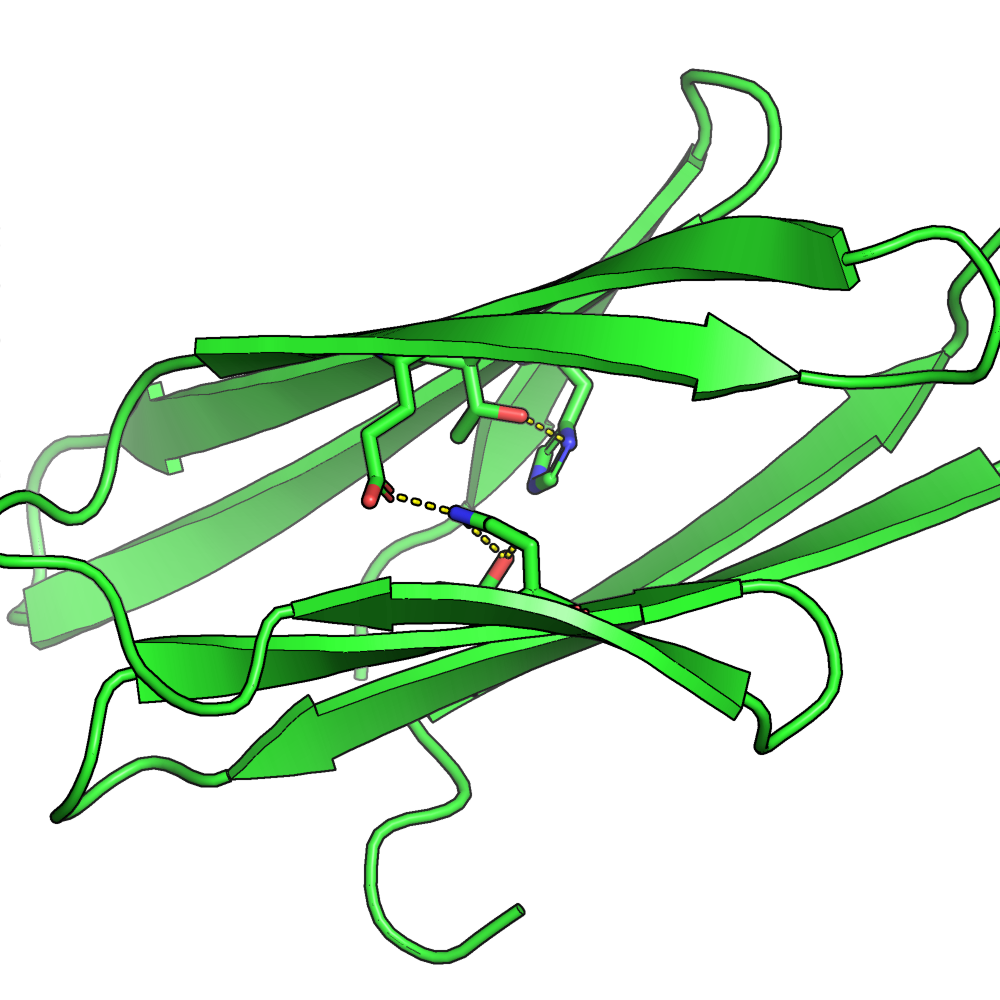
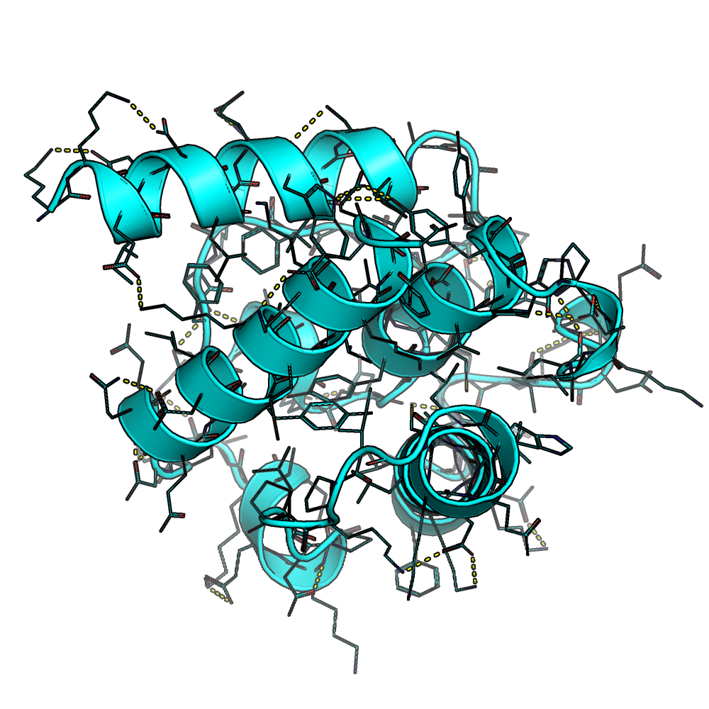

# Resfile Interface

Authors: Damir Temir, Christian Choe

## Overview

The resfile interface controls the amino acid distributions produced by the baseline and conditional models.
It can be used to specify particular amino acids in certain residues, 
thus guiding the Protein Sequence Design algorithm to produce desired structures.

Example of a resfile:

    ALLAA # set a default command for all residues not listed below
    START
    34 ALLAAwc # allow all amino acids at residue #34
    65 POLAR # allow only polar amino acids at residue #65
    36 - 38 ALLAAxc # allow all amino acids except cysteine at residues #36 to #38 (including)
    34 TPIKAA C # set the initial pose sequence postion at residue #34 to cysteine
    55 - 58 NOTAA EHKNRQDST # disallow the listed amino acids at residues #55 to #58
    20 NATRO # do not design the residue #20 at all

## Using resfile

To use a resfile, create a new `.txt` where you specify all the flags. Then run:

    python3 run.py --pdb pdbs/3mx7_gt.pdb --resfile txt/resfiles/<name of a resfile>.txt

## List of Functions

### Body

This is a **complete list of the commands that can be specified in the body** for particular residue ids:

| Command | Description |
| ------ | ----- |
|ALLAA|Allows all amino acids|
|ALLAAwc|Allows all amino acids (including cysteine)|
|ALLAAxc|Allows all amino acids (excluding cysteine)|
|POLAR|Allows only polar amino acids (DEHKNQRST)|
|APOLAR|Allows only non-polar amino acids (ACFGILMPVWY)|
|PIKAA|Allows only the specified amino acids|
|NOTAA|Allows only those other than the specified amino acids|
|NATRO|Disallows designing for that residue|
|TPIKAA|Sets the specified amino acid in the initial sequence|
|TNOTAA|Sets the amino acid other than the specified in the initial sequence|

### Header

The header _can take_ these commands to limit **all residues not specified in the body**:

| Command | Description |
| ------ | ----- |
|ALLAA|Allows all amino acids|
|ALLAAwc|Allows all amino acids (including cysteine)|
|ALLAAxc|Allows all amino acids (excluding cysteine)|
|POLAR|Allows only polar amino acids (DEHKNQRST)|
|APOLAR|Allows only non-polar amino acids (ACFGILMPVWY)|
|PIKAA|Allows only the specified amino acids|
|NOTAA|Allows only those other than the specified amino acids

**NOTE**: The header command must be followed by the keyword **START** on a new line.

The header _cannot take_ these commands for the following reasons:

| Command | Reason |
| ---- | ----- |
|NATRO|Extracting residues for which the algorithm shouldn't design is a separate process. Please specify the range of residues to preserve in the body instead `ex. 1 - 90 NATRO`|
|TPIKAA|Setting the particular residues in the initial sequence is a separate process. Please specify each amino acid for each residue in the body instead `5 TPIKAA C`|
|TNOTAA|For the same reason as above. Please specify all amino acids to avoid in initializing for each residue instead `ex. 5 TNOTAA HKRDESTNQAVLIMFYWPG`|

### Ranges

You can specify the ranges for which the command should apply. For example:

    1 - 90 NATRO # will preserve all residues from residue #1 to #90 (including #90)

The ranges can be specified for _all_ body commands, but **cannot be specified in the header section**.

### Initial Sequencing

With the `TPIKAA` and `TNOTAA` commands we can initialize the sequence with particular amino acids.

    1 TPIKAA C
    2 TPIKAA T
    3 TPIKAA Y
    4 TNOTAA ACFGILMPVWYDEHKNQRS # will set res #4 to T since it's the only one not restricted
    ...

Will result in an initial sequence `CTYT...`

**NOTE**: you can still specify other commands for those residues that will restrict them in the following designs using the conditional model and not the baseline model. 

## Results

An example of a designed all-beta structure using the **backbone [3mx7_gt.pdb](../../pdbs/3mx7_gt.pdb)** with the **[resfile](../../txt/resfiles/resfile_3mx7_gt_ex1.txt)**:

Before | After |
:------:|:------|
|

An example of a designed all-alpha structure using the **backbone [1bkr_gt.pdb](../../pdbs/1bkr_gt.pdb)** with the **[resfile](../../txt/resfiles/resfile_1bkr_gt_ex6.txt)**:

Before | After |
:------:|:------|
|

